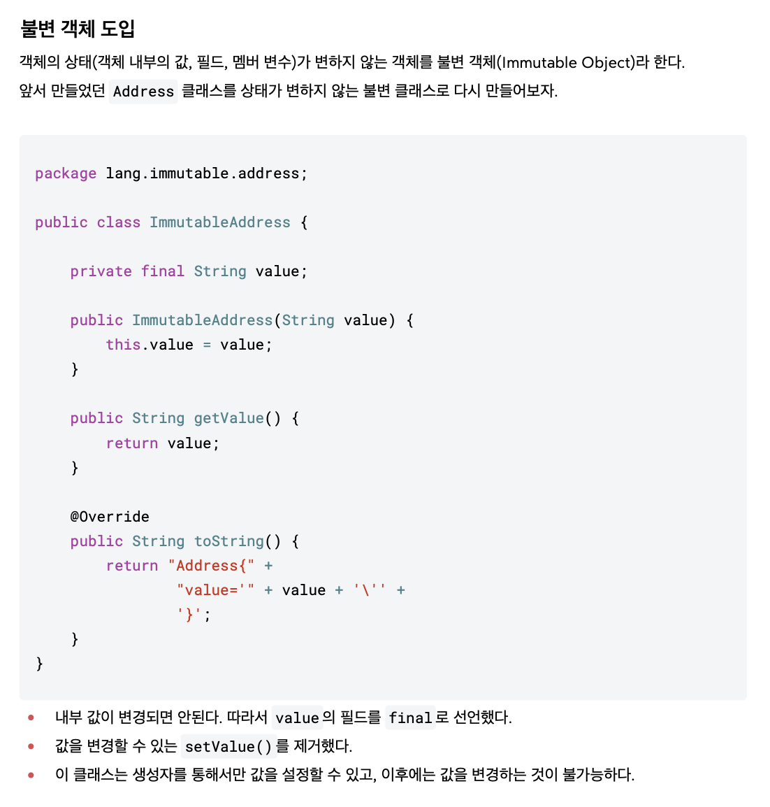

# Immutable Object
- 객체의 상태가 변하지 않는 불변의 객체

### 불변 객체 필요성
- 공유하면 안되는 객체를 여러 변수에서 공유하면 side effect 발생
- referrence type의 공유를 막을 수 없으니, 변경을 막자

### 불변이라는 단순한 제약 -> side effect 방지
- 객체의 공유를 막을 수 없다
- 분변 객체는 값을 변경할 수 없다 -> side effect 방지
- 새로운 객체를 생성해야 한다.
  - 참조하는 값에 영향을 줄 수 없다

## 기본형과 참조형의 공유
- 기본형: 하나의 값을 여러 변수에서 절대로 공유하지 않는다.
- 참조형: 하나의 객체를 참조값(주소값)을 통해 여러 변수에서 공유할 수 있다.

## 공유 참조와 side effect
- 계산된 주된 작업 외에 추가적인 부수 효과를 일으킨 것

## 불변 객체 == Immutable Object
- 공유하면 안되는 객체를 여러 변수에서 공유했기 때문에 side effect가 발생한 문제를 방지
- 직접적인 원인 : 공유된 객체의 값 변경


### field를 변경하지 못하게 만들어버림
- final field 선언
- setValue() 제거
```java
public class ImmutableAddress {
    private final String value;

    public ImmutableAddress(String value) {
        this.value = value;
    }

    public String getValue() {
        return value;
    }

    @Override
    public String toString() {
        return "ImmutableAddress{" +
                "value='" + value + '\'' +
                '}';
    }

    public void setValue(String value) {
        this.value = value;// compile error
    }
}
```

## String == 불변 객체
- java가 기본으로 제공하는 것들이 공유 참조 문제를 막기위해 불변 객체로 제공하고 있다.
- 불변 객체 종류
   - String
   - Inteager
   - LocalDate

## Immutable 설계하는 이유
- 캐시 안정성
- 멀티 쓰레드 안정성
- 엔티티의 값 타입