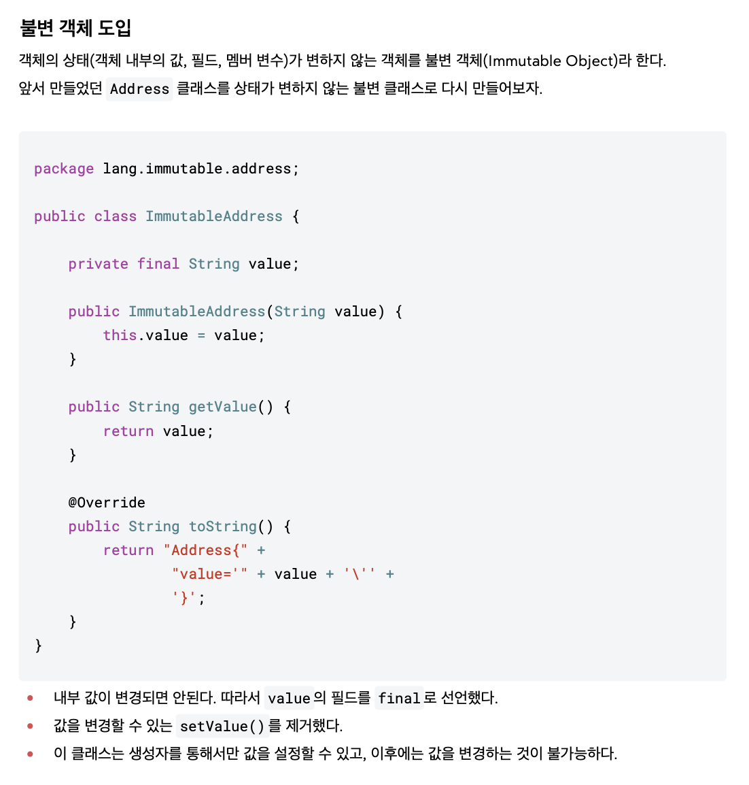

## 기본형과 참조형의 공유
- 기본형: 하나의 값을 여러 변수에서 절대로 공유하지 않는다.
- 참조형: 하나의 객체를 참조값(주소값)을 통해 여러 변수에서 공유할 수 있다.

## 공유 참조와 side effect
- 계산된 주된 작업 외에 추가적인 부수 효과를 일으킨 것

## 불변 객체 == Immutable Object
- 공유하면 안되는 객체를 여러 변수에서 공유했기 때문에 side effect가 발생한 문제를 방지
- 직접적인 원인 : 공유된 객체의 값 변경

- final field 선언
- setValue() 제거

## String == 불변 객체
- 불변 객체 종류
   - String
   - Inteager
   - LocalDate

## Immutable 설계하는 이유
- 캐시 안정성
- 멀티 쓰레드 안정성
- 엔티티의 값 타입