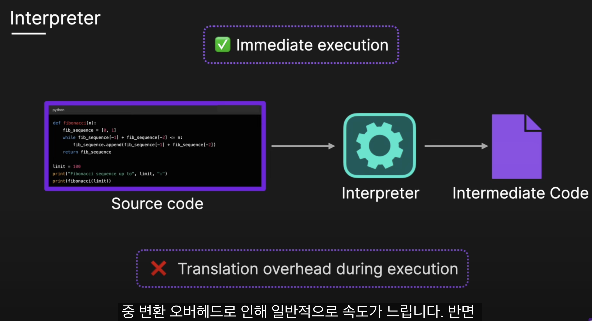
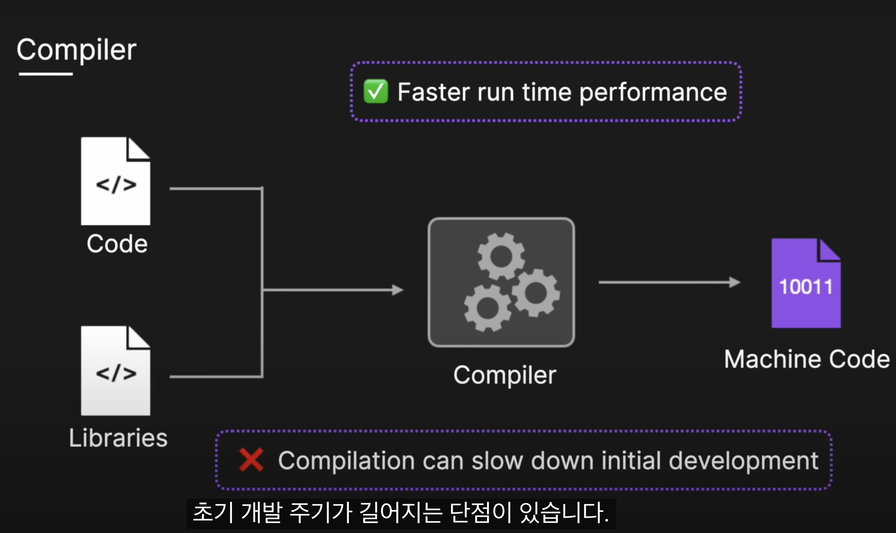
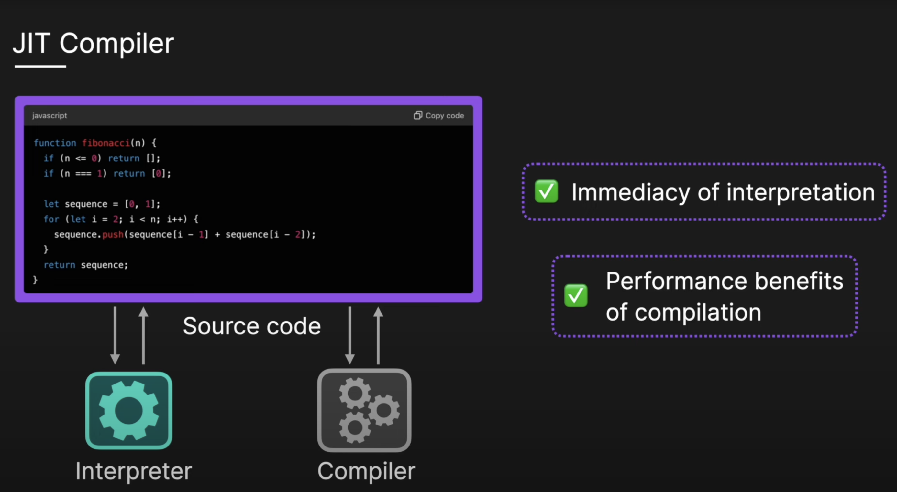
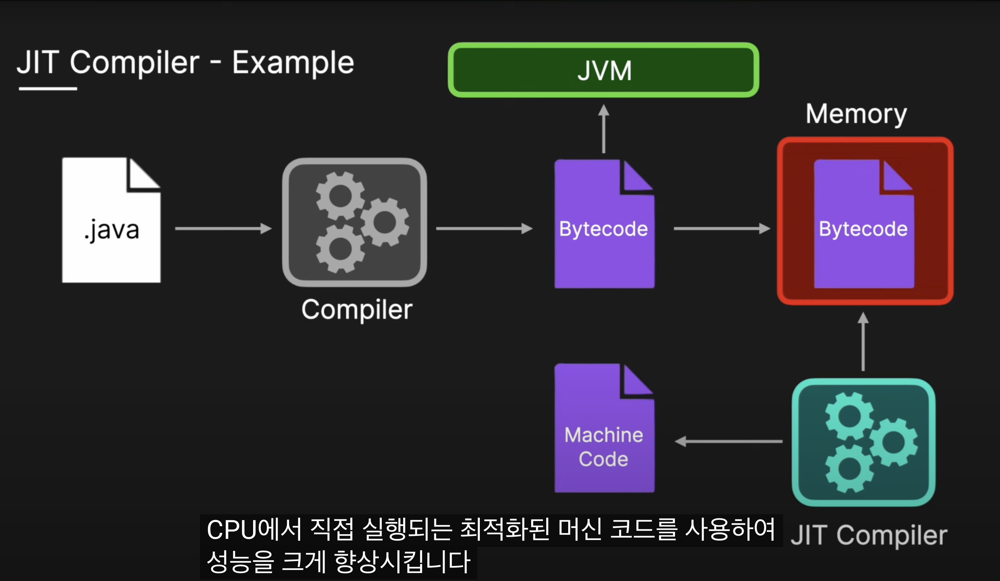

## 핫스팟 가상머신
- 참고: https://mangkyu.tistory.com/301

- Hotspot VM은 초기에 인터프리터를 사용해서 최적화 없이 코드를 실행
- Hotspot VM은 각 메소드의 호출 여부를 계속해서 주시한다. 
- 각 메서드의 호출 횟수를 추적
- 호출 횟수가 C1 컴파일러의 임계값을 초과하면 해당 메소드를 C1 컴파일러 대기열에 넣고 재컴파일하여 최적화한다. 
- 이후에도 계속 각 메서드의 호출 횟수를 추적하여 동일하게 최적화를 진행하는데, 
- C1 이후에는 C2 컴파일러를 사용한다. 
- 컴파일러를 순차적으로 적용하는 방식을 계층형 컴파일(Tiered Compliation)이라고 한다.

## JIT Compliler
- 출처: https://youtu.be/mQ-vQ2BlKrw?si=B0iVO4lEKXkHHuYR
### interpreter
- 소스를 직접 변환하거나
- 중간 형태로 변환하여 
    - 중간 실행을 허용
- 런타임에 line by line으로 프로그램을 실행
- 장점: 즉시 실행할 수 있다
- 단점: 실행 변환 중 오버헤드로 인해 속도가 느리다

### Compiler
- 실행 전에 전체 코드 소스를 기계어 코드로 변환한다
- 프로그램을 처음 실행하기 전에 모든 코드를 기계어로 컴파일 한다
- 장점: 코드가 이미 실행 가능한 형태 -> 런타임 성능이 빨라짐
- 단점: 컴파일 단계: 시간이 많이 소요됨 -> 초기 개발 주기가 길다

### JIT Compliler
- Just In Time Compiler
- 프로그램이 실행이 시작된 후, 컴파일러가 실행중에
    - 코드를 컴파일하여 해석과 컴파일의 이러한 접근 방식을 연결합니다
- 컴파일 한 후, 자주 실행되는 부분을 기계어 코드로 컴파일
- 동적 런타임 정보를 활용하여 코드를 최적화 한다
   - 자주 사용되는 함수를 인라인으로 처리해 -> 성능 향상

- javac 컴파일러를 사용하여 해당 소스를 플랫폼 독립적인 코드로 컴파일 한다 -> .class 파일 생성(Bytecode)
- JVM의 class loader는 .class 파일을 메모리에 로드 한다
- 런타임에 .class(Bytecode)를 동적으로 load 한다
- hotspot == 자주 실행되는 코드 경로
- JVM은 자주 실행되는 코드 경로를 식별하고
- jit compiler는 hotspot을 Bytecode에서 최적화된 네이티브 머신 코드로 변환
- 핫스팟의 후속 실행은 cpu에서 직접 실행되는 최적화된 머신 코드를 사용하여 성능을 크게 향상 시킴