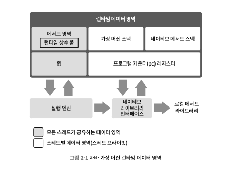
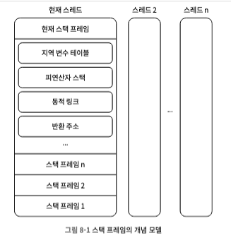

# 2부 자동 메모리 관리
# 2장. 자바 메모리 영역과 메모리 오버플로

- 자바 가상 머신이 제공하는 자동 메모리 관리 메커니즘

- 장점
    - 메모리 할당
    - 메모리 해제
    - 메모리 누수, 메모리 오버 플로 문제를 거의 겪지 않는다.

- 단점
    - 문제가 터지면 가상 머신의 메모리 관리 방식을 이해하지 못하는 한 해결하기 어렵다

## 가상 메모리 관리
- 각 영역이 수행하는 역할
- 관리 대상
- 생길 수 있는 문제 설명

-------------------------------------------
## 2.2. 런타임 데이터 영역
- 자바 가상 머신은 자바 프로그램을 실행하는 동안, 메모리를 몇개의 영역으로 나눔

- 종류
  - 1) 프로그램 카운터
  - 2) 자바 가상 머신 - 스택
  - 3) 네이티브 메서드 - 스택
  - 4) 자바 힙 (공유)
  - 5) 메서드 영역 (공유)
  - 6) 런타임 상수 풀
  - 7) 다이렉트 메모리

#### 전통적 C, C++ 메모리 구조
- 힙 메모리
- 스택 메모리

#### java 메모리 구조
- 스택 == 자바 가상 머신 - 스택 (지역 변수 테이블)
- 힙

#### 지역 변수 테이블
* 1) 메서드 매개 변수
* 2) 메서드 안에서 정의된 지역 변수
* 위 두개를 저장하는 공간
- 저장하는 데이터 종류
    - 기본 데이터 타입
    - 객체 참조 주소
    - 반환 주소 타입
- 저장하는 공간(가장 작은 단위) : 지역 변수 슬롯
- 슬롯 하나의 크기 : 32bit
- 컴파일 과정에서 데이터 공간을 할당
    - 메서드 실행 중에 데이터 공간은 변하지 않는다
    - 자바 메서드 -> 스택 프레임 -> 지역 변수 테이블 -> 크기는 이미 정해짐

### 1. 프로그램 카운터(pc) 레지스터
- 작은 메모리 영역
- 현재 실행 중인 스레드의 바이트 코드 줄 번호 표시기
- 바이트 코드 인터프리터 : 프로그램 카운터의 값을 변경
    - 다음에 실행할 바이트 코드 명령어를 선택
    - 프로그램 제어의 흐름
    - 분기
    - 순환
    - 점프
    - 예외 처리
    - 스레드 복원
- 멀티 쓰레딩
    - cpu 코어를 여러 스레드가 교대로 사용함
    - 특정 시각에 각 코어는 한 스레드의 명령어를 실행하게 됨
- 스레드 각각에는 고유한 프로그램 카운터가 필요함
    - thread private memory: 각 스레드 카운터 -> 서로 영향을 주지 않는 독립된 영역에 존재

- 스레드가 자바 메서드 실행 중일 때
    - 프로그램 카운터에 기록: 실행중인 바이트코드 명령어의 주소
- 스레드가 네이티브 메서드를 실행 중일 때
    - 프로그램 카운터 값 : undefied : 정의되지 않음
- 유일하게 out of memory error 조건이 명시되지 않은 유일한 영역

### 2. 자바 가상 머신 - 스택
- thread private
- 연결 된 thread와 운명이 같음(생성/삭제)
- 각 메서드가 호출될 때 마다 push/pop
    - 1) 스택 프레임 생성
    - 2) 지역 변수 테이블
    - 3) 피 연산자 스택
    - 4) 동적 링크
    - 5) 메서드 반환 값

### 3. 네이티브 메서드 - 스택
- 가상 머신 스택, 거의 비슷
- 차이점
   - 가상 머신-스택: 자바 메서드 실행할 때 사용 == 바이트 코드
   - 네이티브 메서드-스택: 네이티브 메서드 실행할 때 사용

### 4. 힙 == GC heap
- java application이 사용할 수 있는 가장 큰 memory
- 모든 thread가 공유한다
  - 객체 할당 효율을 높이고자
     - 스레드 로컬 할당 버퍼를 여러 개로 나눈다
- 가상 머신이 구동될 때 만들어진다
- 유일한 목적: 객체 인스턴스를 저장하는 것
- 모든 객체 인스턴스, 배열 -> 힙에 할당된다
- gabage collector가 관리하는 대상
- 공간이 나뉨 for 목적 : 메모리의 회수/할당을 빠르게 하기 위해서
  - 신세대
  - 구세대
  - 영구 세대
  - 에덴 공간
  - 생존자 공간

### 5. 메서드 영역 == non heap
- 런타임 상수 풀
- 모든 thread가 공유한다
- 데이터 종류
    - 가상 머신이 읽어 들인 타입 정보
    - 상수
    - 정적 변수
    - JIT 컴파일러가 컴파일한 코드 캐시
- 회수 효과 적다

### 6. 런타임 상수 풀
- 메서드 영역의 일부
- 상수 풀 테이블 : 클래스 설명 정보
   - 클래스 버전
   - 필드
   - 메서드
   - 인터페이스
   - 컴파일 타임에 생성된 
       - 다양한 리터럴
       - 심벌 참조
- 가상 머신이 클래스 파일을 로드 실행 -> 각 바이트에는 명세가 요구하는 데이터가 있어야 한다.
- 동적
    - 상수는 꼭 컴파일 타임에 생성되지 않는다
    - 상수 풀에 내용 전부가 미리 완벽하게 기술되어 있지 않다.
- 메서드 영역에 포함되므로 그 이상 다른 공간은 확장할 수 없다.
- 공간이 부족하면 out of memory error

### 7. 다이렉스 메모리

---------------------
## 2.3. 핫스팟 가상 머신에서의 객체 들여다보기
- 1. 객체 생성
- 2. 객체의 memory out
- 3. 객체에 접근하기

### 1. 객체 생성
- 자바는 객체 지향 프로그래밍 언어
- 자바는 모든 것을 객체로 만들어져 있다
- new 키워드 사용 -> 수시로 객체를 만들 수 있음
- new 명령 : 바이트 코드
   - new 명령의 매개 변수가 상수풀 안의 클래스를 가리키는 심벌 참조인지 확인한다
   - 심벌 참조가 뜻하는 클래스가 아래를 확인한다
       - class loading (로딩)
       - class resolve (해석)
       - class initialize (초기화)

### 2. 객체의 메모리 아웃

### 3. 객체에 접근하기

---------------------
## 2.4. 실전 : out of memory error 예외
- out of memory error
  - java heap - over flow
  - stack - over flow
  - 메서드 영역 - over flow
  - 런타임 상수 풀 - over flow
  - native direct memory - over flow

### 1. 자바 힙 오버 플로

### 2. 가상 머신 스택과 네이티브 메서드 스택 오버 플로

### 3. 메서드 영역 오버 플로

### 4. 런타임 상수 풀 오버 플로

### 5. 네이티브 다이렉트 메모리 오버 플로

---------------
