### 서비스 지연
- JVM memory Leak
- Heap Dump
### 장애 대응
- APM
- 제니퍼?
- 시큐어 코딩??
---------------
- 참고 유튜브 : https://youtu.be/FMUpVA0Vvjw?si=DOUXvlHsw-J0MLG7
### JVM 구조
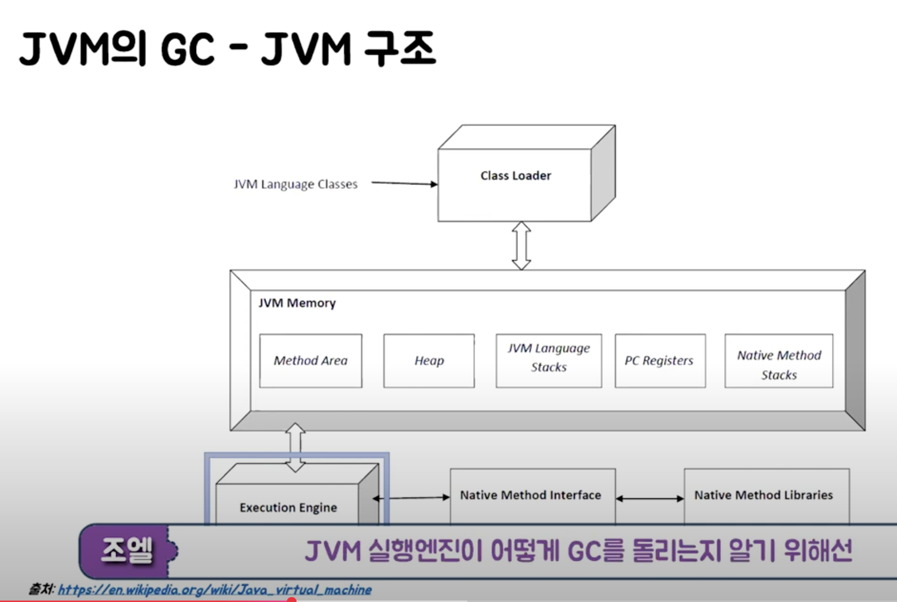

#### 1. Class Loader
- 바이트 코드를 읽고, 클래스 정보를 -> 메모리의 Heap/Method Area에 저장

#### 2. JVM Memory
- 실행 중인 프로그램의 정보가 올라가 있는 메모리

#### 3. Execution Engine
- 바이트 코드를 네이티브 코드로 변환
- GC를 실행하는 실행 엔진

#### JVM Memory 구조
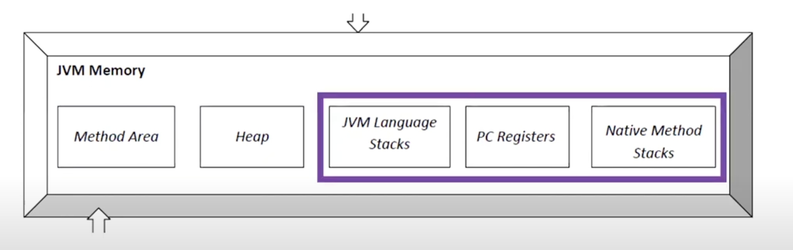
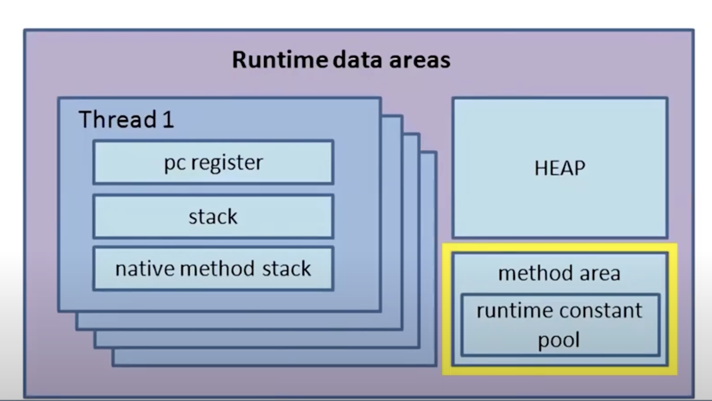

##### method area
- 프로그램의 클래스 구조를 메타데이터처럼 가짐
- 메서드의 코드 들을 저장

#### heap
- 가비지 컬렉터에 의해 관리 되는 영역
- 어플리케이션 실행 중에 생성되는 객체 인스턴스를 저장하는 영역

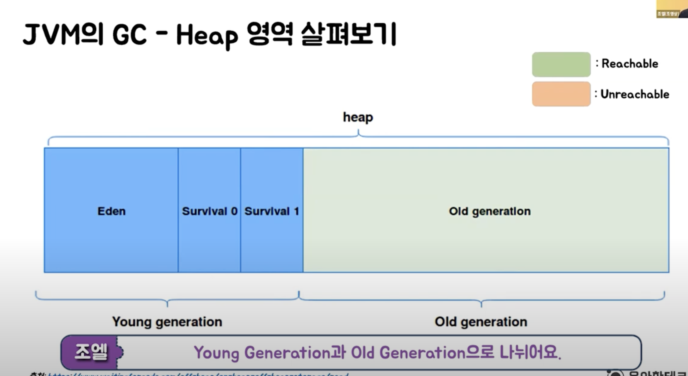

##### Young generation == minor GC
- 1) eden
    - 새롭게 생성된 객체들이 할당되는 영역
- 2) survival0
    - minor GC로부터 살아남은 객체들이 존재하는 영역
- 3) survival1

- survival0, survival1 둘 중 하나는 꼭 비어 있어야 한다.

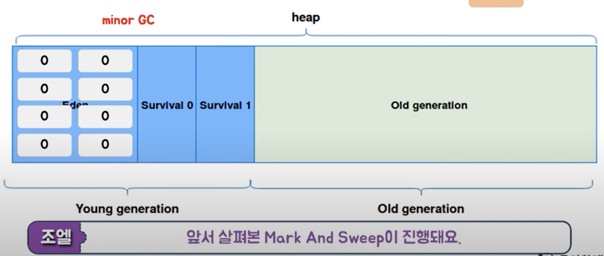
- 새로운 객체가 계속 생성되다 보면 -> eden에 가득 차게 됨 -> Minor GC 진행됨(mark & sweep)
- Reachable : survival0 으로 이동
    - age bit : 숫자가 1로 증가 
- Unreachable : survival1 로 이동
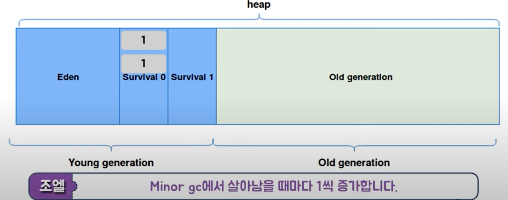

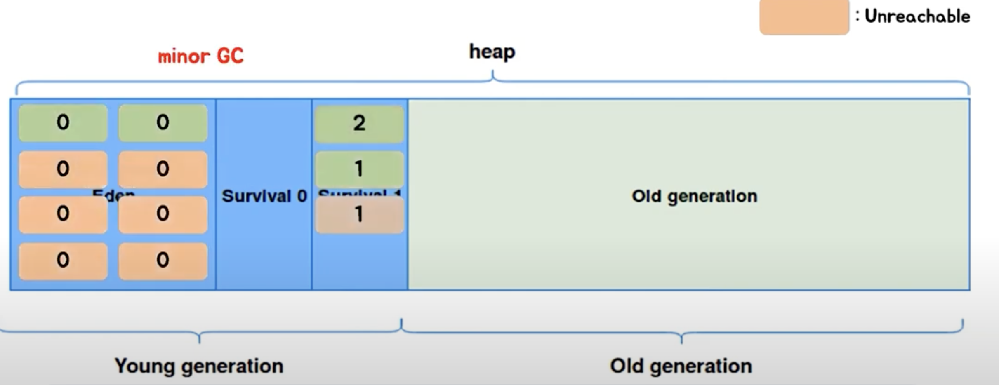

##### Old generation == major GC
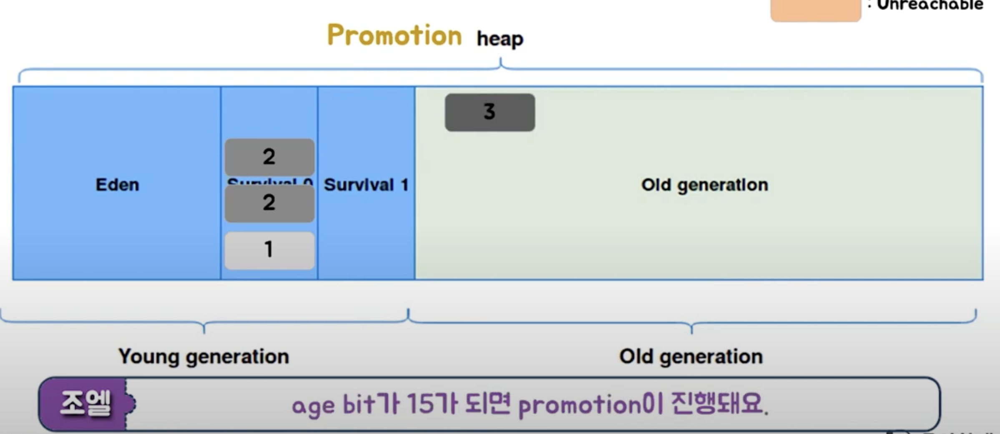
- 오랫동안 참조가 된 객체이구나(오래 썻네~, 아직도 쓰네?)
- age-bit 가 3이 되면 객체를 old generation으로 이동 시킨다
- 이동 시키는 것을 promotion 이라고 한다
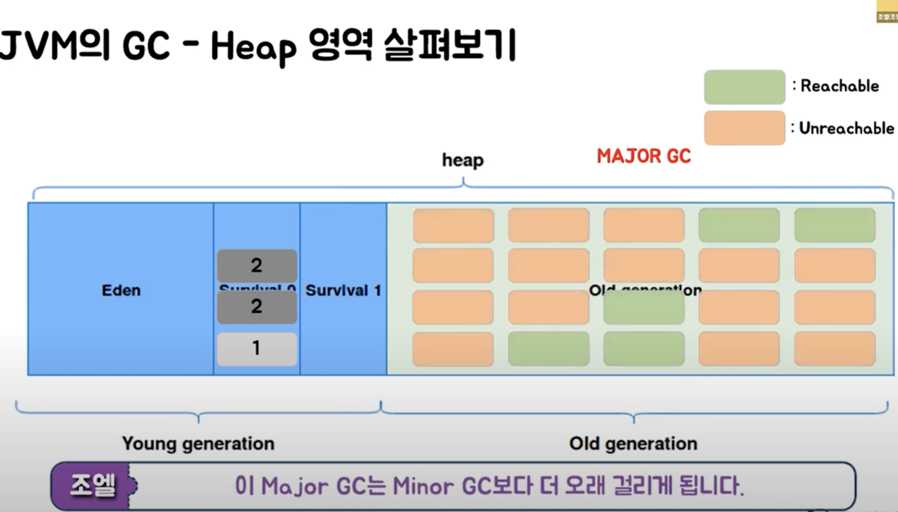
- major GC는 minor GC 보다 오래 걸린다

#### stack
- 메서드 호출을 stack frame 이라는 block 쌓음
- 로컬 변수, 중간 연산 결과 저장함

#### pc register
- 쓰레드가 현재 실행할 stack frame의 주소를 저장

#### native method stack
- c/c++ 의 low level 코드를 실행하는 stack

---------------
### gc가 왜 필요한가?
- 프로그램이 동적으로 할당했던 메모리 영역(heap) 중 필요 없게 된 영역(어떤 변수도 가리키지 않음) 알아서 해제 시킴
- 장점
    - 메모리 누수
    - 해체된 메모리 접근
    - 해제한 메모리 또 해제
- 단점
   - gc 작업 : 순수 오버헤드
   - 개발자가 언제 gc하는지 모름

----------
----------
----------
# 가비지 컬렉터와 메모리 할당 전략
- 가비지 컬렉션의 역사는 java 보다 오래 되었다.
- 리스프 (1960 mit에서 개발된 언어) : 동적 메모리 할당, 가비지 컬렉션 기술을 처음 사용

### 가비지 컬렉션, 메리 할당의 내부를 이해해야 하는 이유
- 다양한 메모리 오버 플로우 문제
- 메모리 누수 문제 해결
- 더 높은 동시성을 달성해야함
    - 가비지 컬렉션이 방해가 되면 이 자동화를 적절히 모니터링하고 조율해야 해서이다.

#### 어떤 메모리를 회수?
#### 언제 회수?
#### 어떻게 회수?

- memory over flow
- memory leak
- 높은 동시성

### 스레드와 함께 생성되고 소멸
- 프로그램 카운터
- 가상 머신 스택
- 네이티브 메서드 스택

### 가비지 컬렉터 -> 동적 메모리 관리함 -> (동적)메모리 할당, (동적)메모리 회수
#### 대상
- 자바 힙
- 메서드 영역
#### 이유
- 구현한 클래스마다 요구하는 메모리 크기가 다르다
- 런타임에 알 수 있다
   - 어떤 객체를 생성할지
   - 얼마나 메모리가 많이 들지

## 대상이 죽었는가?
### 참조 카운팅 알고리즘
- 해당 객체에 접근할 수 있는 방법이 하나도 없다면
- reference count가 0 이 되면 가비지 컬렉션의 대상이 된다

#### 객체를 가리키는 참조 카운터를 추가한다
- 참조 카운팅 알고리즘은 횟수를 세기 위해 약간의 메모리를 추가로 사용한다
- 원리가 간단, 판단에 드는 에너지도 적다
- 대다수 상황에서 좋은 알고리즘이다

#### 메모리 관리에 참조 카운팅 사용
- 마이크로소프트 COM, 파이썬, 러스트
- 게임용 스크립트 언어 스퀼

### Reference Counting 이미지
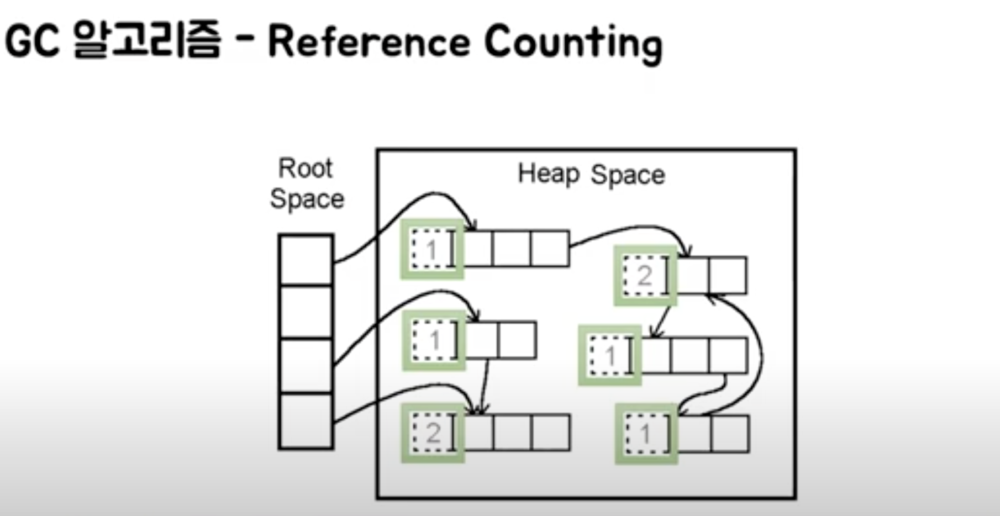

### 한계

#### 순환 참조
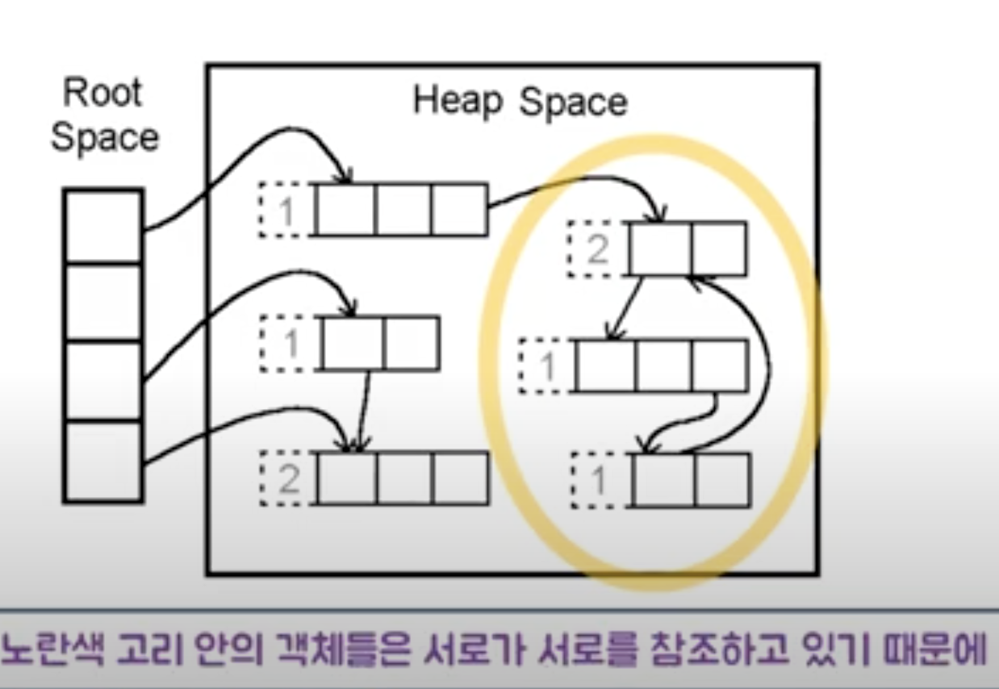

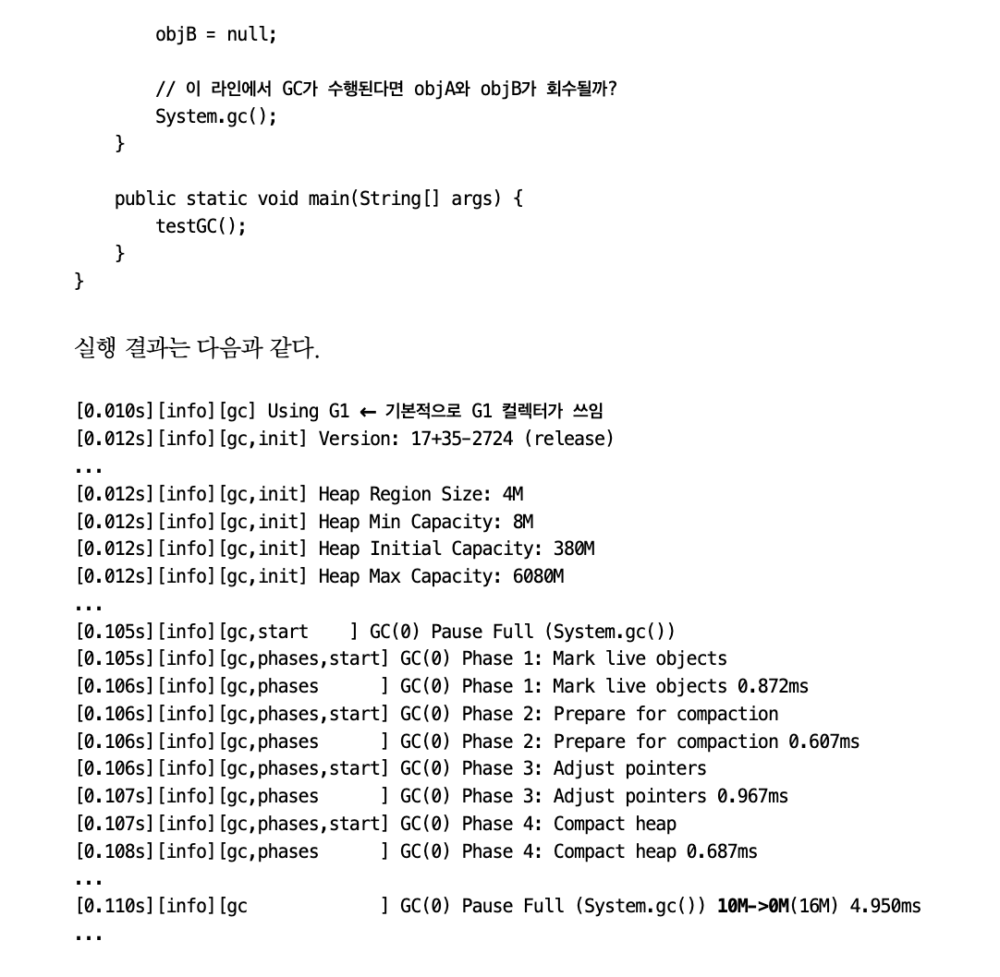
- 서로가 서로를 참조하고 있는데, 직접적으로 사용되는 곳은 없음
- 사용되지 않는 영역이 정리되지 않음
- 결국 memory leak 발생

----------------------------
## 도달 가능성 분석 알고리즘 == reachability analysis
- GC root 사용 -> 시작 노드 집합
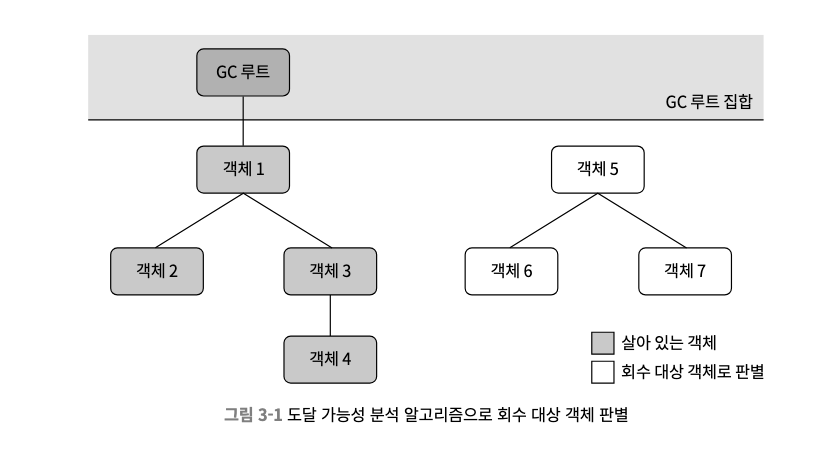

### JVM의 Root Space 어디인가?
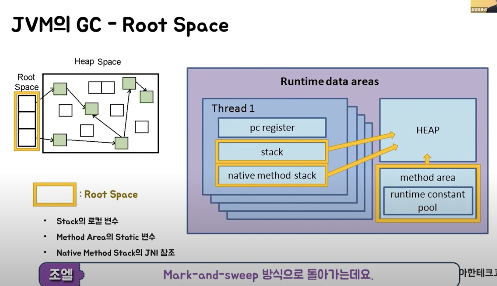

#### jvm 메모리
1) stack : 로컬 변수
2) method area : static 변수
3) native method stack : c/c++로 작성된 JNI 참조

### GC root 사용 가능한 것
* 가상머신 스택에서 참조하는 객체 
  - 현재 실행 중인 메서드에서 쓰는 
    - 매개변수
    - 지역변수
    - 임시 변수
* 메서드 영역에서 클래스가 정적 필드로 참조하는 객체
  - 자바 클래스
    - 참조 타입 정적 변수

* 메서드 영역에서 상수로 참조되는 객체
  - 문자열 테이블 안의 참조

* 네이티브 메서드 스택에서 JNI가 참조하는 객체

* 자바 가상 머신 내부에서 쓰이는 참조
  - 기본 데이터 타입에 해당하는 class 객체
  - nullpointException
  - OutOfMemoryError
  - 일부 상주 예외 객체
  - 시스템 클래스 로더

* 동기화락으로 잠겨 있는 모든 객체

* 자바 가상머신 내부 상황을 반영하는 JMX Bean
  - JVMTI에 등록된 콜백
  - 로컬 코드 캐시

### 다른 객체들도 임시로 추가될 수 있다
- 가비지 컬렉터 종류에 따라
- 메모리 영역에 따라 

### 요즘 GC
- 부분 컬렉션 지원
- gc rootr가 많아지지 않도록 최적화 적용

## 도달 가능성 분석 알고리즘 - 유예 단계
### 첫번째 필터링 : finalize() 메서드 실행
- F-Queue에 추가된다
- 가상머신이 나중에 우선순위가 낮은 종류자 스레드를 생성
- 객체의 finalize() 메서드를 실행시킴
- 근데.. 잊어라

----------------------------
## 다시 참조 이야기로
### 참조?
- 참조 타입 데이터에 저장된 값이 
  - 다른 메모리 조작의 시작 주소를 뜻하면
  - 이 참조 데이터를 
  - 해당 메모리 조각이나 객체를 참고한다고 말한다 

#### 강한 참조
- Object obj = new Object();
- 가비지 컬렉터가 절대 회수 하지 않는다

#### 부드러운 참조
- 유용함, 필수는 아님
- 메모리 오버 플로우가 나기전에
   - 두번째 회수 목록에 추가
- JDK 1.2 추가

#### 약한 참조
- 유용함, 필수는 아님, 연결 강도가 더 약함
- 다음번 가비지 컬렉션까지만 살아 남음
- 메모리가 넉넉하더라고
   - 약한 참조 객체는 모두 회수 된다
- JDK 1.2 추가

#### 유령 참조
- 객체 수명에 아무런 영향을 주지 않음
- 객체 인스턴스를 가져오는 것 불가능
- 객체가 회수 될때 알림을 받기 위한 용도
- JDK 1.2 추가

----------------------------
## 메서드 영역 회수하기
### 메서드 영역은 가비지 컬렉션의 대상이 아니다?!
- 반드시 청소 해야 하는 것은 아니다(자바 가상 머신 명세)
- 효율이 낮다

### 회수 하는 영역
1. 더 이상 사용 되지 않는 상수
2. 더 이상 사용 되지 않는 클래스

### 예저
1. 상수 풀에서 리터럴 회수
- 문자열 java가 상수 풀에 들어 있음
- 현재 시스템 값이 java인 문자열 객체는 하나도 없다
   - java 상수를 참고하는 문자열 객체가 없다
   - 가상 머신에서 이 리터럴을 사용하는 코드가 한 곳도 없다

2. 클래스 회수
- 클래스의 인스턴스가 모두 회수 됨
   - 자바 힙에 클래스의 인스턴스 없음
- 클래스를 읽어들인 클래스 로더가 회수됨
- 객체를 아무곳에서도 참조 하지 않음
- 리플렉션 기능으로 이 클래스의 메서드를 이용하는 곳이 없음

----

## 가비지 컬렉션 알고리즘

### 세대 단위 컬렉션 이론
1. 약한 세대 가설
- 대다수 객체는 일찍 죽는다

2. 강한 세대 가설
- 가비지 컬렉션 과정에서 살아남은 횟수가 늘어날 수록 오래 살 가능성이 높아진다

#### 구역 나눔
1. 곧바로 죽을 영역
2. 살아 남는 소수 영역
- 한번 살아남은 객체는 잘 죽지 않는다
- 가상 머신이 이 영역을 회수하는 빈도를 줄인다

#### 구역 나눔 효과
- 가비지 컬렉션에 드는 전체시간이 줄어듬
- 메모리 공간도 효율적으로 이용함

#### 신세대
- minor GC : 신세대만 대상으로 하는 가비지 컬렉션
- 다수의 객체가 죽는다

#### 구세대
- major GC : 구세대만 대상으로 하는 가비지 컬렉션
- 살아남은 소수

#### 세대 간 참조의 개수 << 같은 세대 안에서의 참조 개수
- 세대 간 참조 수는 아주 적다
- 구세대 전체를 탐색하는것은 낭비이다
- 어떤 객체들이 존재하는지, 어떤 세대간 참조가 있는지 기록하는 것은 공간 낭비

--------------------------
### mark & sweep
- 쓰레기에 체크 !!

#### 특징
- reference counting의 Circle Reference Problem을 해결 할 수 있다

#### 설명
- Root 에서 해당 객체에 접근 가능한지를 해제의 기준으로 삼는다.
- Mark : Root부터 Graph 순회를 통해, 연결된 객체를 찾아냄
- Sweep : 연결이 끊어진 객체들은 지운다
- Reachable : root랑 연결된 객체
- Unreachable : root랑 연결되지 않은 객체
- 메모리 정리 후 객체가 예쁘게 정렬됨
    - Compaction : 메모리 파편화를 막음
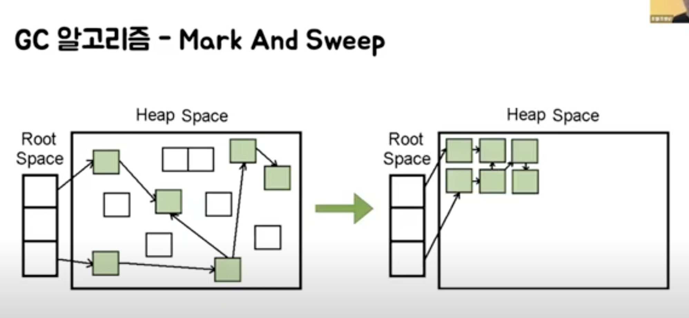

#### 장점
- 순환 참조 객체를 없앨 수 있음

#### 단점
1. 실행 효율이 일정하지 않다
- 자바 힙이 다량의 객체로 가득 차 있음
   - 대부분이 회수 대상이면, 표시하는 일, 회수하는 일도 너무 크다
- 객체가 많아 질수록 대상이 많아져서 효율이 떨어짐

2. 메모리 파편화 심함
- 가비지 컬렉터가 쓸고 간 자리에는 불연속적 메메뢰 파편이 만들어짐
- 큰 객체를 만들려고할때, 충분한 크기의 연속 메모리 찾기 어려움

3. 의도적으로 GC를 실행 시켜야 한다
   - 어느 순간 실행 중인 어플리케이션이 GC에게 컴퓨터 resource를 양보 해야 한다

4. 어플리케이션 실행 && GC 실행이 병행된다
   - 어플리케이션의 사용성을 유지하면서 효율적이게 GC를 실행하는 것이 꽤나 어려운 최적화 작업이다.
   - Stop The World
   - GC를 실행하기 위해 JVM이 app 실행을 멈추는 것

------------------------------
### mark & copy
- 객체가 많아질수록 효율성이 떨어지는 mark&swap 문제 해결
- 가용 메모리를 똑같은 크기로 블록 나눔
- 한 블록만 사용한다
- 한 블록이 가득차면
   - 살아남은 객체들만 다른 블록에 복사한다
   - 기존 블록은 다 삭제

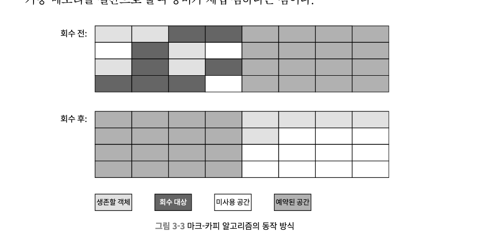
#### 특징
- 대다수가 살아남으면 -> 시간 낭비 : 메모리 복사에 시간 낭비
- 대다수가 죽으면 -> 소수의 객체만 다른 블록에 복사 -> 메모리 파편화 정리

#### 장점
- 구현하기 쉬움, 실행 효율 좋음
#### 단점
- 가용 메모리가 반으로 줄어듬 -> 낭비 심함

#### 사용처
- 신세대 구역에 적용

#### 아펠 스타일
- 신세대를 나눈다
   - 에덴 공간 (8)
   - 생존자 공간1 (1)
   - 생존자 공간2
- 신세대에 할당된 메모리 중 90%만 사용
- 낭비하는 공간은 10%

#### 아펠 예외
##### 핸들 승격
- minor GC에서 살아남은 객체가 많아서
   - 생존자 공간이 다 수용 못하면
   - 구세대의 메모리 메모리 할당을 보증한다

#### 단점
- 객체 생존율이 높을 수록, 복사 할게 많아서 효율이 낮아짐
- 메모리 공간 50% 낭비

------------------
### mark & compact
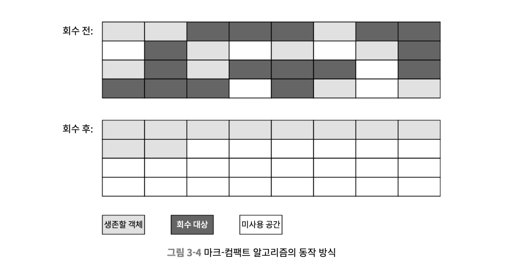
- 구세대에 적용할 알고리즘
   - 살아남는 객체가 많다
- 표시는 마크&스왑 동일
- 메모리 이동 발생
   - 생존한 모든 각체를 메모리 영역 한쪽 끝으로 모음
      - 나머지 공간을 한꺼번에 비움

----
## 핫스팟 알고리즘 상세 구현
### 루트 노드 열거

### 안전 지점

### 안전 지역

### 기억 집합, 카드 테이블

### 쓰기 장벽

### 동시 접근 가능성 분석

---

## 클래식 가비지 컬렉터
### 시리얼 컬렉터
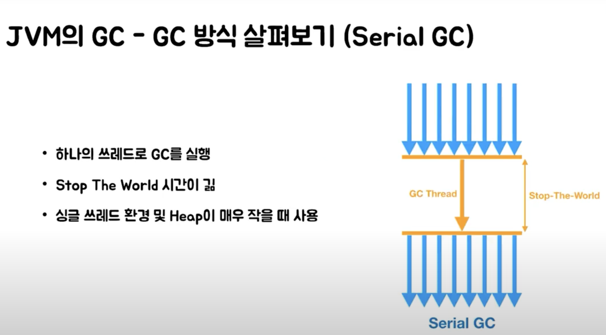
- 하나의 thread로 GC를 실행
    - Stop The World 시간이 길다
- single thread 환경 및 Heap 이 매우 작을때만 사용한다

### 파뉴 컬렉터

### 패러렐 스캐빈지 컬렉터

- 여러 thread 로 GC 실행
    - Stop THe World 시간이 SerialGC 보다 짧아짐
- 멀티 코어 환경에서 app 처리 속도를 향상시키기 위해 사용됨
- java 8에서 기본으로 쓰이는 GC

### 시리얼 올드 컬렉터

### 패러렐 올드 컬렉터

### CMS 컬렉터
- Concurrent-Mark-Sweep
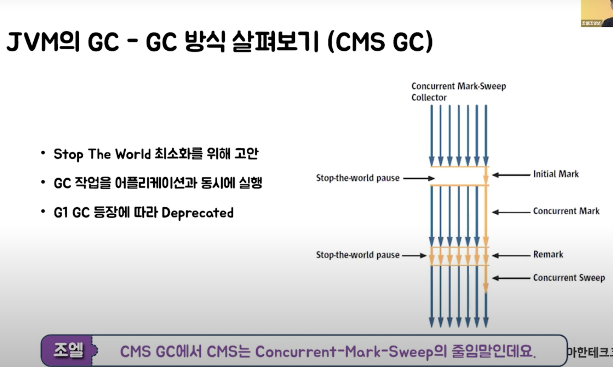
- Stop The World 최소화를 위해 고안
- GC 작업 && application 동시에 실행
- G1 GC 등장으로.. 사라짐

#### 단점
- 메모리, CPU를 많이 사용함
    - mark & sweep 과정 이후, 메모리 파편화 해결하는 Compaction이 기본으로 제공되지 않음

### G1 컬렉터(가비지 우선 컬렉터)
- Garbae First == 가비지 우선
- GC 가 일어날 때, 전체 영역(Eden, Survival, Old generation)을 탐색하지 않는다.

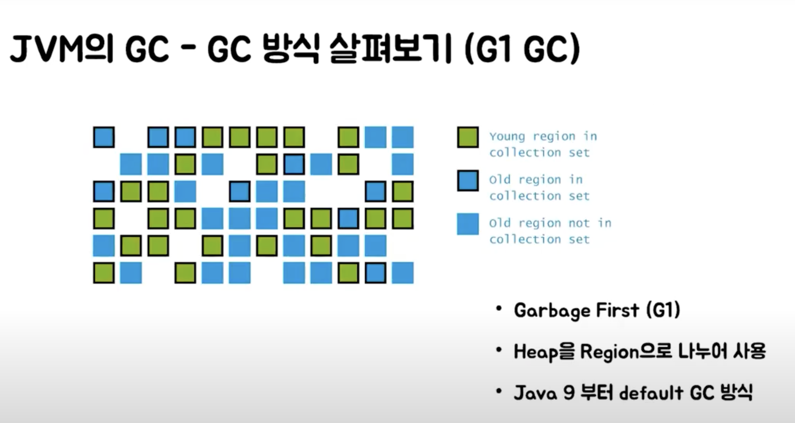
- heap을 일정 크기의 region 나눔
    - Young Generation
    - Old Generation
- Runtime에 G1 GC가 필요해져서
    - 영역별 Region 개수를 튜닝한다
    - Stop The World를 최소화 시킴
- java 9 이상부터, 기본 GC 실행 방식

### 오늘날 가비지 컬렉터들

------

## 저지연 가비지 컬렉터
### 셰넌도어

### ZGC

### 세대 구분 ZGC

------

## 적합한 가비지 컬렉터 선택하기
### 앱실론 컬렉터

### 컬렌터들 간 비교 및 취사 선택

### 가상 머신과 가비지 컬렉터 로그

### 가비지 컬렉터 매개 변수 정리

----------
## 실전: 메모리 할당, 회수 전략

### 객체는 먼저 에덴에 할당된다

### 큰 객체는 곧바로 구세대에 할당된다

### 나이가 차면 구세대로 옮겨진다

### 공간이 비좁으면 강제로 승격 시킨다

---------
### StringBuilder
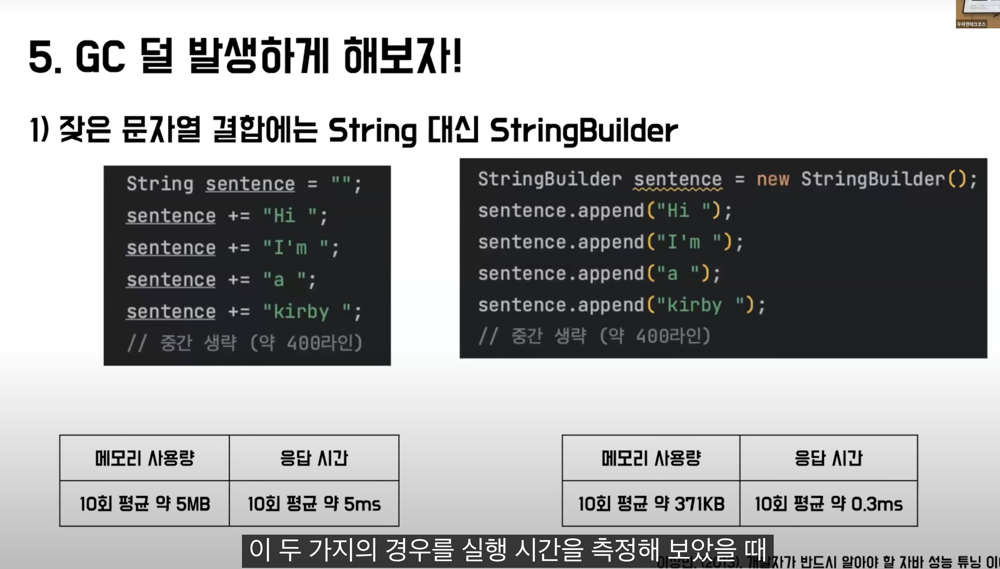

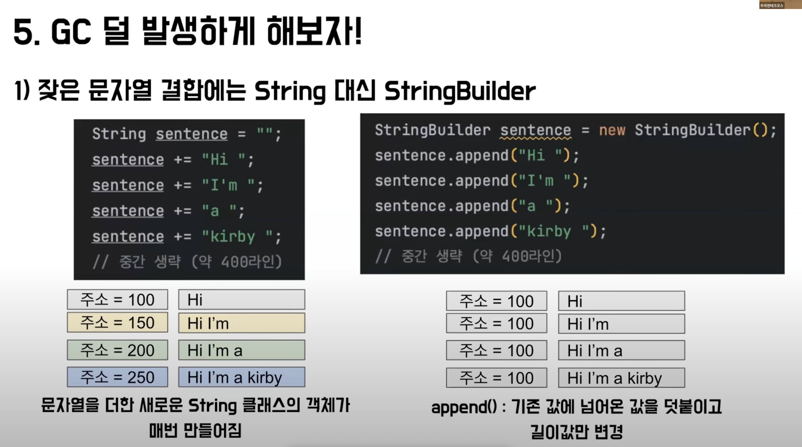

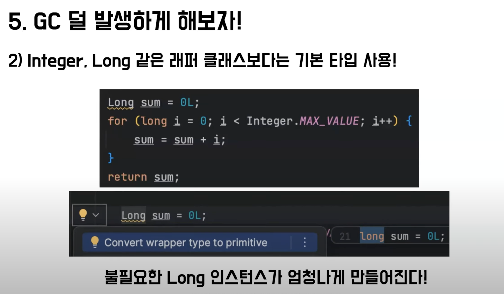

### static 변수 : GC
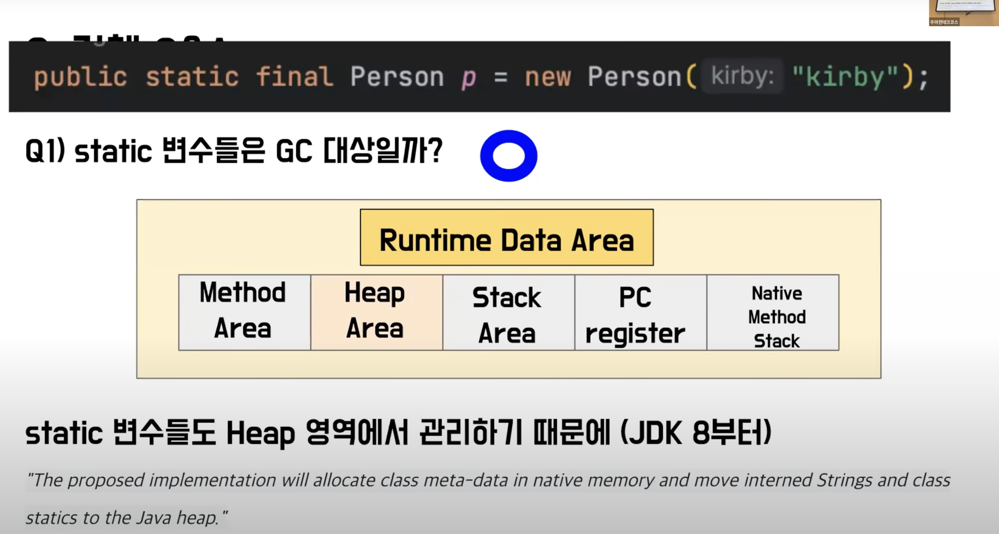
- java 7 까지는 관리 대상이 맞음