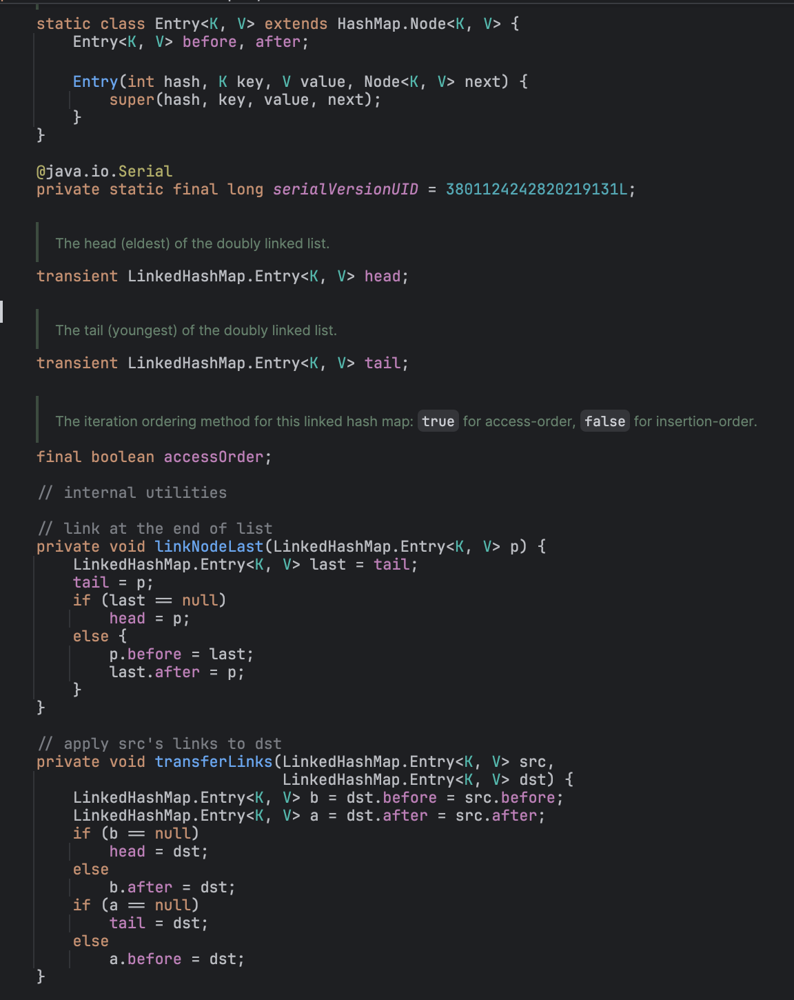
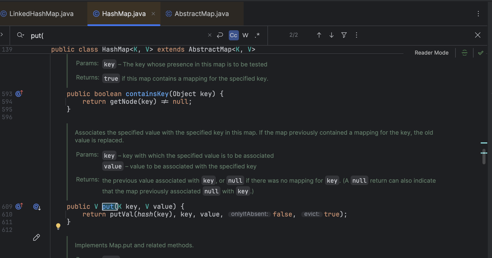
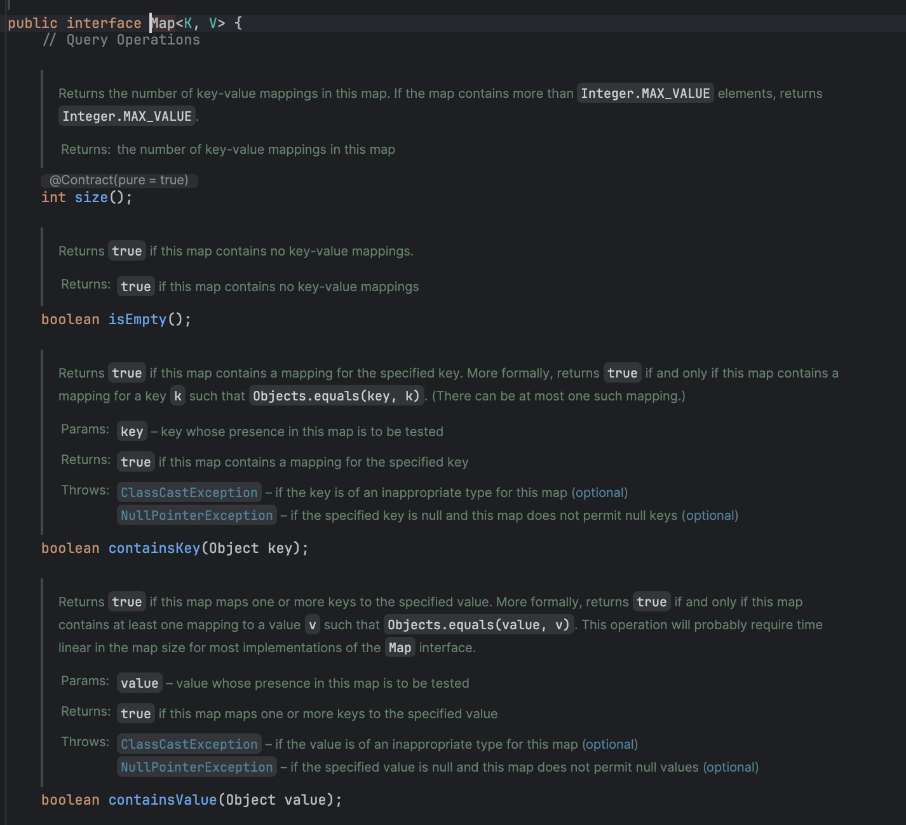

# java.util.LinkedHashMap

### 설명
- LinkedHashMap = HashMap + 이중 연결 리스트
- 삽입 순서 or 접근 순서를 유지
- accessOrder = true를 사용하면 LRU 캐시 쉽게 구현 가능
- removeEldestEntry로 자동 퇴출 정책 적용 가능

| 구성 요소         | 역할                                |
| ------------- | --------------------------------- |
| **해시 테이블**    | key → value 빠른 조회 (O(1))          |
| **이중 연결 리스트** | entry의 순서를 관리 (삽입 순서 or 접근 순서 유지) |


### HashMap vs LinkedHashMap 비교
| 항목        | `HashMap`  | `LinkedHashMap`                             |
| --------- | ---------- | ------------------------------------------- |
| 저장 순서     | 없음 (순서 랜덤) | 삽입/접근 순서 유지                                 |
| 성능        | O(1) 평균    | 약간 느림 (O(1))                                |
| 메모리 사용량   | 낮음         | 추가적인 before/after 포인터 저장 필요                 |
| LRU 캐시 구현 | 직접 구현 필요   | `accessOrder + removeEldestEntry`로 자동 구현 가능 |


### 구성 요소
```text
[헤드] <-> A <-> B <-> C <-> [테일]
```
- 각 노드(entry)
  - key
  - value
  - next (해시 체인 연결)
  - before (이전 노드)
  - after (다음 노드)

### 생성자
```
LinkedHashMap()
LinkedHashMap(int initialCapacity)
LinkedHashMap(int initialCapacity, float loadFactor)
LinkedHashMap(int initialCapacity, float loadFactor, boolean accessOrder)
```
| 파라미터              | 설명                                                   |
| ----------------- | ---------------------------------------------------- |
| `initialCapacity` | 초기 해시 버킷 크기 (기본값 16)                                 |
| `loadFactor`      | 해시 테이블의 채워지는 비율 (기본값 0.75)                           |
| `accessOrder`     | `false` → 삽입 순서 유지, `true` → 접근 순서 유지 (LRU 캐시 구현 가능) |


---
## concreate class: LinkedHashMap
```java
public class LinkedHashMap<K,V>
    extends HashMap<K,V>
    implements Map<K,V>

    // put 함수 없음 -> HashMap에서 작성한 put() 함수 사용함
```

- entry
```java
static class Entry<K,V> extends HashMap.Node<K,V> {
        Entry<K,V> before, after;
        Entry(int hash, K key, V value, Node<K,V> next) {
            super(hash, key, value, next);
        }
    }
```
- capture


---
## concreate class: HashMap
```java
public class HashMap<K,V> extends AbstractMap<K,V>
    implements Map<K,V>, Cloneable, Serializable {

    @java.io.Serial
    private static final long serialVersionUID = 362498820763181265L;

        static final int DEFAULT_INITIAL_CAPACITY = 1 << 4; // aka 16

// put 함수 이거로 씀!!
    public V put(K key, V value) {
        return putVal(hash(key), key, value, false, true);
    }
```
- capture



---
## abstract class: AbstractMap
```java
public abstract class AbstractMap<K,V> implements Map<K,V> {
    // 생성자
    protected AbstractMap() {
    }

    public int size() {
        return entrySet().size();
    }

    public boolean isEmpty() {
        return size() == 0;
    }

    public V get(Object key) {
        Iterator<Entry<K,V>> i = entrySet().iterator();
        if (key==null) {
            while (i.hasNext()) {
                Entry<K,V> e = i.next();
                if (e.getKey()==null)
                    return e.getValue();
            }
        } else {
            while (i.hasNext()) {
                Entry<K,V> e = i.next();
                if (key.equals(e.getKey()))
                    return e.getValue();
            }
        }
        return null;
    }
// put 함수 따로 재정의 안하면 오류냄
    public V put(K key, V value) {
        throw new UnsupportedOperationException();
    }
```

---
## interface class: Map
```java
public interface Map<K, V> {
    int size();
    boolean isEmpty();
    boolean containsKey(Object key);
    boolean containsValue(Object value);
    V get(Object key);
    
    // put 선언해라~~
    V put(K key, V value);
    V remove(Object key);
    void putAll(Map<? extends K, ? extends V> m);
    void clear();

    // 내부 interface Set 선언
    Set<K> keySet();
    Collection<V> values();
    Set<Map.Entry<K, V>> entrySet();

    interface Entry<K, V> {
        K getKey();
        V getValue();
        V setValue(V value);
        boolean equals(Object o);
        int hashCode();
        public static <K extends Comparable<? super K>, V> Comparator<Map.Entry<K, V>> comparingByKey() {
            return (Comparator<Map.Entry<K, V>> & Serializable)
                (c1, c2) -> c1.getKey().compareTo(c2.getKey());
        }
        ...
    }
    // interface에서도 함수를 추가할 수 있음
        default void forEach(BiConsumer<? super K, ? super V> action) {
        Objects.requireNonNull(action);
        for (Map.Entry<K, V> entry : entrySet()) {
            K k;
            V v;
            try {
                k = entry.getKey();
                v = entry.getValue();
            } catch (IllegalStateException ise) {
                // this usually means the entry is no longer in the map.
                throw new ConcurrentModificationException(ise);
            }
            action.accept(k, v);
        }
    }

```
- capture



-----------
## transient?? 

```java
    transient Node<K,V>[] table;
    transient Set<Map.Entry<K,V>> entrySet;
    transient int size;
    transient int modCount;
    int threshold;
    final float loadFactor;
```
#### 이유 1. 저장할 필요가 없는 내부 구조
- table은 메모리에서만 필요한 자료구조이므로 직렬화하지 않습니다.
- table은 해시 맵의 실제 버킷 구조입니다.
- 직렬화할 때 이 배열을 그대로 저장할 필요가 없습니다.
- 대신 key와 value만 저장해도 나중에 해시를 다시 계산하여 table을 복원할 수 있습니다.

#### 이유 2. 저장하면 비효율적
- Node[] 배열에는 비어 있는 버킷이 많을 수 있습니다.
- 이걸 그대로 저장하면 쓸데없이 용량만 커집니다.
- 직렬화 시에는 entrySet()을 통해 실제 key-value 쌍만 저장하면 됩니다.

### transient의 기본 개념
- 자바에서 객체를 파일, 네트워크 등으로 저장하거나 전송하려면 직렬화가 필요합니다.
- 이때 객체의 모든 필드가 기본적으로 직렬화 대상이 됩니다.

- 하지만 어떤 필드는 저장할 필요가 없거나 저장하면 문제가 생기는 경우가 있습니다.
- 이럴 때 transient 키워드를 붙이면 직렬화에서 제외됩니다.
  - 캐시, 임시 값, 계산 결과 같은 다시 계산 가능한 값
  - 보안상 노출되면 안 되는 비밀번호, 인증 토큰
  - OS 레벨 리소스(파일 핸들, 소켓 등)처럼 직렬화 불가능한 값

```java
class User implements Serializable {
    private String name;
    private transient String password; // 저장하지 않음

    public User(String name, String password) {
        this.name = name;
        this.password = password;
    }
}
// user.dat 파일에는 name만 저장되고 password는 저장되지 않습니다.
User user = new User("Alice", "secret");
ObjectOutputStream oos = new ObjectOutputStream(new FileOutputStream("user.dat"));
oos.writeObject(user);
oos.close();
```